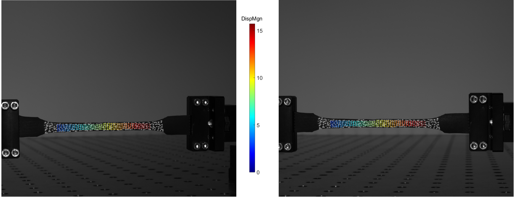

# Summary

Three-dimensional Digital Image Correlation (3D-DIC) is a non-contact optical-numerical technique for measuring the 3D shape and full-field displacement, deformation, and strain, from stereo digital images of the surface of an object. 3D-DIC is useful in numerous applications, such as characterizing the mechanical behavior of materials and structures, quantifying material parameters, and validating numerical simulations.

`DuoDIC` is a freely available open source MATLAB toolbox for 2-camera stereo 3D-DIC, which can be used either as a standalone package or as functions in custom scripts. `DuoDIC` receives two series of synchronized images taken from two cameras: (1) images of a flat checkerboard target, which are used to calibrate the stereo camera pair; and (2) images of a speckled test object, which may undergo movement and deformation. The toolbox processes the image series and integrates several camera calibration algorithms with the 2D subset-based DIC software `Ncorr` [@Blaber2015], to transform matching image points into 3D points, and outputs a dynamic point cloud, meshed surfaces, rigid body motion, and full-field displacement, deformation, and strain measures. Furthermore, `DuoDIC` offers advanced functions to visualize various measures on the 3D meshes and overlaid on the original images.

The simple user interface allows novice users to perform 3D-DIC analyses without interacting with MATLAB syntax, while stand-alone functions can be integrated in custom scripts by more proficient MATLAB users. As such, `DuoDIC` is suitable for students, researchers, and professionals in various fields.

The package is composed of four main scripts: (1) stereo camera calibration; (2) image cross-correlation (2D-DIC); (3) 3D reconstruction; and (4) post-processing. This paper describes the algorithms implemented in each step and demonstrates its performance in two test cases, which are also included as sample data: rigid body translations of a cylindrical container and uniaxial tension of a rubber dog-bone specimen.

# Statement of need

3D-DIC is useful in numerous applications where the full-field displacements and strains are required, primarily for measuring the mechanical response of materials and structures and for characterizing mechanical properties, with widespread applications from nano- to macro-scale, and rapid progress and developments [@Reu2015, @Sutton2017, @Pan2018]. 3D-DIC is preferable over strain gages and extensometers due to its non-contact nature and the large amount of local information that can be collected.

Commercial 3D-DIC software are typically expensive, proprietary and closed-source, which may pose a barrier, especially for students and researchers. Notable free and open-source 3D-DIC contributions include `DICe` [@Turner2015], `MultiDIC` [@Solav2018], and `ADIC3D` [@Atkinson2021]. Each of these packages uses different algorithms for correlation and stereo calibration and requires different calibration targets. Specifically, our previous toolbox `MultiDIC` focused on multi-view applications, therefore required a non-planar calibration object, which is relatively difficult to make accurate, thus preventing easy implementation. To this end, `DuoDIC` enables a simpler calibration procedure that requires only a flat checkerboard pattern. In addition, with respect to `MultiDIC` we improved the post-processing and visualization options. `DuoDIC` is written in MATLAB, providing the flexibility and simple implementation of a high-level language, which meets the needs of the experimental mechanics community. Moreover, a main advantages of open-source software is the ability to compare results and performance, and to cross-validate the implementation of different algorithms and approaches. To this end, `DuoDIC` may also comprise a complementary tool for researchers in the field.

# Algorithms and workflow
The entire 3D-DIC procedure in `DuoDIC` is organized in four main scripts, which the user can run without having to interact with any MATLAB syntax. \autoref{fig:workflow} outlines the workflow of the 3D-DIC procedure. The functionality and algorithms incorporated in each step are detailed in the sub-sections below.
The figures in this section represent sample data, which are provided with the toolbox. The experimental setup used for taking these images consisted of two machine-vision cameras (BFS-U3-51S5M-C, FLIR, USA), each equipped with a 5.0 MP Sony IMX250 monochrome sensor and a 25 mm lens (Fujinon HF25SA-1, Fujifilm Corporation, Japan). The cameras were synchronously hardware-triggered using a MatchID Triggerbox (MatchID, Belgium). A rubber dog-bone specimen, cut out of a bicycle tube, was mounted on an optical table (Thorlabs, USA), such that its left end was fixed and its right end was moved to the right in 19 steps with 1 mm increments, such that A total of 20 images were taken from each camera (one reference state and 19 deformed states).

## Step 1: Stereo camera calibration
In this step, the intrinsic and extrinsic parameters of both cameras are computed by integrating functions from MathWorks Computer Vision Toolbox, which implement algorithms by Zhang [@Zhang2000], Heikkila and Silven [@Heikkila1997], Bouguet [@Bouguet], and Bradski and Kaehler [@Bradski2008]. This script takes as input multiple simultaneous images of a checkerboard target captured by two cameras in a stereo pair. The checkerboard pattern points in each image is automatically detected and used for calibrating the cameras' intrinsic and extrinsic parameters. The intrinsic parameters include focal lengths, principal point (optical center), and up to 6 distortion coefficients. The user can choose between [0,2,3] radial distortion coefficients, [0,2] tangential distortion coefficients, and [0,1] skew parameter. The extrinsic (stereo) camera parameters comprise the 3D position and orientation of the second camera with respect to the first (a total of 6 degrees of freedom). Furthermore, the computed camera parameters are used for computing the reprojection errors, which represent the distance between the reprojected and the detected pattern points, and comprise the accuracy of the estimated camera parameters. An example of the results, which are presented at the end of this step is shown in \autoref{fig:calibration}. This calibration was obtained using 52 stereo images of a pattern with a square size of 10 mm, which are included in the sample data provided with the toolbox.

## Step 2: Image cross-correlation (2D-DIC)
In this step, the script receives multiple images of a speckled test object captured simultaneously by the stereo camera pair. Typically, the first pair of images represents the unloaded, or undeformed, configuration and the rest of the images represent deformed states. `Ncorr` toolbox [@Blaber2015] is utilized in this step to detect a dense grid of matching points on all images. Although Ncorr was created as a 2D-DIC toolbox, typically receiving images from a single camera, `DuoDIC` utilizes it to detect matching points on images taken from two different views. The images from both cameras in all states are then cross-correlated with the reference image, to detect corresponding points in the selected region of interest (ROI), as demonstrated in \autoref{fig:corr}. For interpreting the values of the correlation coefficients, refer to [@Blaber2015] and [@Solav2018]. Furthermore, the point grid is meshed with triangular elements, which are later used in Step 4 for calculating the deformation and strain measures.

## Step 3: 3D reconstruction
The results from Step 1 and Step 2 are combined in this step to obtain the 3D position of each image point using stereo triangulation. The set of matching points on each pair of stereo images (as computed in Step 2) are first being undistorted using the intrinsic camera parameters of each camera, according to the distortion model selected in Step 1. Consequently, the image points are transformed into 3D world points using the stereo camera parameters computed in Step 1. In addition, the reprojection errors are obtained for each point, by calculating the distance (in pixels) between the detected and the reprojected points. At the end of this step, the 3D point cloud and triangulated surface are plotted and animated, utilizing function from the GIBBON toolbox [@Moerman2018]. Two animated figures plot the values of the matching correlation coefficient and the reprojection errors, as shown in \autoref{fig:step3} for the last image in the series, which represents the configuration with the largest stretch.

## Step 4: Post processing
The 3D coordinates calculated in Step 3 are used in this step to derive the full-field displacement, deformation, and strain maps. The displacements are calculated for each point, and the deformations and strains are calculated for each triangular element, using the Cosserat point element method [@Solav2014; @Solav2016; @Solav2017; @Solav2017b]. Detailed information on the post processing methods can be found in the `MultiDIC` paper [@Solav2018]. In short, for each triangular element, the position vectors of its vertices are used to calculate the deformation gradient tensor $\mathbf{F}$, from which the right and left Cauchy-Green deformation tensors ($\mathbf{C}=\mathbf{F}^T\mathbf{F}$ and $\mathbf{B}=\mathbf{FF}^T$, respectively) are derived, as well as the Green-Lagrangian and Eulerian-Almansi strain tensors ($\mathbf{E}=0.5(C-I)$ and $\mathbf{e}=0.5(\mathbf{I}-\mathbf{B}^{-1})$, respectively). The principal components and directions of these tensors are computed for deriving the principal stretches $\lambda_i$ and strains $E_i$ and $e_i$, as well as the equivalent (Von-Mises) strain, maximal shear strain, and area change.

\autoref{fig:disp_img} and \autoref{fig:princ_strain_3d} show two example figures, plotting the 3D displacement magnitudes overlaid on the images and first and second principal Lagrangian strains (magnitude and directions) on the 3D triangular mesh, respectively. Examples of animated GIF files exported using `DuoDIC` can be found in the GitHub repository.

# Validation using a rigid body motion (RBM) test
To assess the metrological performance of `DuoDIC`, we performed a rigid body motion experiment, whereby a speckled cylinder was translated using a motorized linear translation stage (PT1/M-Z8, Thorlabs, USA), in 15 increments of 0.2 mm. simultaneous images were captured using the same camera setup described in the previous section. By comparing the displacements measured using the translation stage with those computed using `DuoDIC`, the displacement errors were quantified, as shown in  \autoref{fig:disp_err}. In addition, since strain should vanish for any RBM, any non-zero strains represent measurement errors. \autoref{fig:strains} plots the strains measured during the RBM translations. The results indicate that for this experimental setup, the translations were accurate to within $(1.3 \pm 1.1)\cdot10^{-3}$ mm (mean $\pm$ STD absolute translation error) and the strains errors were $(3.4\pm 2.3)\cdot10^{-4}$.

![Strain values measurements during the RBM test represent the errors in the strain measurement. (a) 3D surface of the cylinder ROI in the last translation step showing the distribution of strains across the surface. (b) Strain results for all the faces measured at each translation step. On each box, the central red line indicates the median, the bottom and top edges of the box indicate the 25th and 75th percentiles, the whiskers extend to the most extreme data points not considered outliers, and the outliers are plotted individually using red points.\label{fig:strains}](fig_strains.png)

<!--  -->

# Acknowledgements
This project was supported by Dana Solav's Jacques Lewiner Career Advancement Chair.

# References
